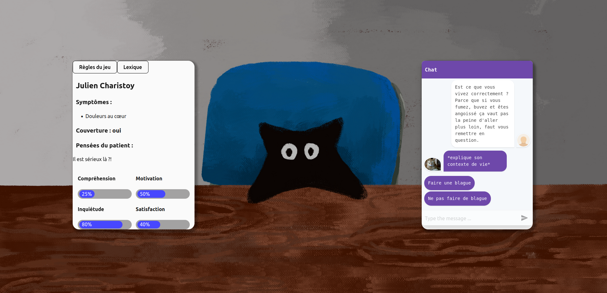

# JAL23-T4-C - Les poids lourds
- **Thème :** santé
- **Durée de développement:** 48h
- **Équipe:** Céline AZHZHAN -  Evguenia SOBINE  - Océane DRUENNE- Charles LESECQ

- Liens vers les évaluations T4 :
  - [Amine Benomar](./Evaluation-T4-Amine_Benomar.md)
  - [Leo Kiefner](./Evaluation-T4-Leo_Kiefner.md)
  - [Robin Miniotti](./Evaluation-T4-Robin_Miniotti.md)
  - [Sylvain Schaefer](./Evaluation-T4-Sylvain_Schaefer.md)
  - [Thomas Goepp](./Evaluation-T4-Thomas_Goepp.md)
  - [Tom Czekaj](./Evaluation-T4-Tom_Czekajr.md)
  - [Yang Vallee](./Evaluation-T4-Yang_Vallee.md)

## Présentation du projet

[Cliquez ici pour accéder au cahier des charges](https://docs.google.com/document/d/1GmWBujbzeklmEQx1wWjIJXjE_vVKne9LEX8vSMA8reQ/edit#&)

La consultation chez un médecin généraliste engage plusieurs aspects (le profil du patient, le comportement du médecin, les termes dits et les actions faites par le médecin) qui entrent en relation. Cela a pour conséquence de modifier l’expérience subjective qu’un patient a de ses problèmes de santé. Notamment vis-à-vis de son inquiétude, de sa motivation à poursuivre un processus de guérison, de sa compréhension de ses problèmes de santé et sa satisfaction par rapport à ce qu’il souhaite obtenir lors de la consultation. 

## Procédures d'installation et d'exécution

Pour jouer au jeu, suivez le lien suivant :

https://t4-poids-lourds.pages.unistra.fr/t4/

## Captures d'écran

## TO DO 
- [X] Cahier des charges 
- [X] Maquette 
- [X] Choix du langage et de l'IDE 
- [X] Mettre en place la structure de code (quelles classes, quelles fonctions)
- [X] Représentations graphiques des objets 
- [X] Code 
- [X] Test 
- [X] Démo 
- [X] dodo

